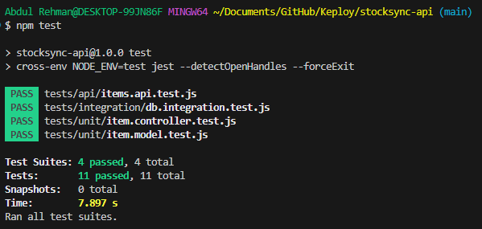

# StockSync Manager API

## API Endpoints

### 1. Get All Items
`GET /api/items`  
**Response:**
```json
[
  {
    "_id": "65a1b2c3d4e5f6a7b8c9d0e1",
    "name": "Laptop",
    "description": "MacBook Pro 16-inch",
    "quantity": 5,
    "lastUpdated": "2025-06-20T10:30:45.000Z"
  }
]
```

### 2. Create New Item
`POST /api/items`  
**Request:**
```json
{
  "name": "Keyboard",
  "description": "Mechanical keyboard",
  "quantity": 10
}
```

### 3. Update Item Quantity
`PATCH /api/items/:id`  
**Request:**
```json
{
  "quantity": 8
}
```

### 4. Delete Item
`DELETE /api/items/:id`  
**Response:**
```json
{
  "message": "Item deleted successfully"
}
```

## Environment Setup

1. Create a `.env` file in the root directory with:
```env
MONGODB_URI=your_mongodb_atlas_connection_string
PORT=3000
```

2. Get your connection string from MongoDB Atlas:
   - Go to your cluster → Connect → Connect your application
   - Copy the connection string and replace credentials

## Running the Server
1. Start MongoDB: `mongod` (or equivalent for your OS)
2. Install dependencies: `npm install`
3. Start server: `node server.js`# StockSync_API


----------------------------------------------------

## Tests

**Testing Framework**: Jest + Supertest  

**Test Types Implemented**:  
✅ Unit Tests (Model/Controller logic)  
✅ Integration Tests (Database operations)  
✅ API Tests (Endpoint validation)  

**Run Tests**:  
```bash
npm test          # Run all test suites
```

## Test Report




## Keploy API Testing


